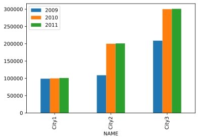

# Example

<!-- non visible HTML comment -->
<!-- non visible HTML comment -->
<!-- non visible HTML comment -->
<!-- non visible HTML comment -->
<!-- non visible HTML comment -->
```
┌─ HEAD-Quarters ───────────────────────────────────┐
│@[https://github.com/earizon/txt_world_domination/]│
├───────────────────────────────────────────────────┤
│ Quick Links:                                      │
│ (#uml) @[#bpmn] @[#geometric] @[#math_symbols]    │
│                                                   │
│ @[#txt_world_domination_ammunition]  link ext     │
│ @[#txt_world_domination_celebration] link ext     │
└───────────────────────────────────────────────────┘
```

* [ammunition](#txt_world_domination_ammunition)
* [celebration](#txt_world_domination_celebration)


### ul Lists:

* l1.1
l1.1 cont.
* l1.2
l1.2 cont.
* l1.3

# This is an h1 title

## This is an h2 (Sub)title

### This is an h3 (subsub) title

### This is an h4 (subsubsub) title

_This is a paragraph with style italic_

__This is a paragraph with style bold__

~This is an strike-through paragraph~



i[./test.svg,width=5em]

Hello [**link**](https://rsms.me/) lol "cat"

Hello from *[link](https://rsms.me/)* to __everyone__ `reading this`

Here's an [**important** anchor link](#example).

line 1  
line 2  

### Embedded HTML

Embedded HTML is disabled except for &gt;br&lt; and HTML comments.

### Block Quotes

> You can insert quotes by
> preceeding each line with `>`.<br/>
>   
> Blockquotes can also contain line
> breaks.


## Lists

### Unordered lists

- Unordered
- Lists
- Hello

### Ordered lists

1. Ordered
2. Lists
4. Numbers are ignored
1. Ordered

121) Ordered lists can start
122) with any number and
123) use . as well as ) as a separator.

### Task lists

- [ ] Task 1
- [x] Task 2
- [ ] Task 3
- Regular list item

## Tables

| Column 1 | Column 2 | Column 3 | Column 4
|----------|:---------|:--------:|---------:
| default | left | center | right

### Table of image file types

| Header                    | Mime type    | Extensions | Description
|---------------------------|--------------|------------|-------------
| `89 50 4E 47 0D 0A 1A 0A` | image/png    | png        | PNG image
| `47 49 46 38 39 61`       | image/gif    | gif        | GIF image
| `FF D8 FF`                | image/jpeg   | jpg jpeg   | JPEG image
| `4D 4D 00 2B`             | image/tiff   | tif tiff   | TIFF image
| `42 4D`                   | image/bmp    | bmp        | Bitmap image
| `00 00 01 00`             | image/x-icon | ico        | Icon image


# Apropos:

- This text file has two purposes:<br/>
  1) Serve as input data used by functional tests.<br/>
  2) Final up-to-date documentation for users.<br/>

  Document source code:
@[https://raw.githubusercontent.com/earizon/txt_world_domination/main/test.txt]

# TESTS START <!-- { test start -->

## TEST: Get sure readers understand the importance of good documentation

        by making a copy of the following paragraph:

        """ ... The documentation and samples are still bad today ...  We ended up
        with a painful difficult-to-understand, hard-to-test,
        even-harder-to-modify mess. Not because we didn't follow the "(Google
        Android) best practices", but precisely because we did!...a large
        part of the official  documentation and samples are still poorly
        written. And it continues to mislead the new generation of
        inexperienced developers. And as Uncle Bob would tell you, most
        developers are new since the IT industry double its size every five
        years ..."
        Citation extracted from:
        https://dev.to/jmfayard/android-s-billion-dollar-mistake-327b

## TEST: Make sure readers understand the key points when creating documentation:

* ✓ PUTTING RELATED INFORMATION CLOSE TO EACH OTHER.
* ✓ DON'T REPEAT TWICE.
* ✓ USE YOUR HARD DISK TO SAVE CLASSIFIED INFORMATION, NOT PILES OF
    DOCUMENTS SPREAD ("HIDDEN" OR "LOST") AMONGST HUNDRED OF EMAILS,
    POSTS, CHATS, WORDS, CUSTOM DATABASES, EXCELS AND BINARY FILES OF
    RANDOM NATURE.
* ✓ DON'T USE PROPRIETARY FORMATS FOR IMPORTANT DOCUMENTATION:
    THE SIMPLEST, THE BEST.
* ✓ AVOID USING (EXPENSIVE AND COMPLEX TO SETUP AND MAINTAIN)
    SEARCH ENGINES TO FIND FOR LOST INFORMATION:
    NEVER LOOSE THE INFORMATION IN FIRST PLACE.

## TEST: Make sure readers understand that text files are enough for event

the most complex projects by adding links to well known successful
projects documented with plain text:

- TCP/IP Internet Protocol Documentation:
  https://www.ietf.org/rfc/rfc793.txt
- HTTP "Web" protocol:
  https://www.rfc-editor.org/rfc/rfc2616
- Linux Kernel documentation:
  https://github.com/torvalds/linux/tree/master/Documentation

## TEST: scaped p and html tags must be displayed properly:

  ```
  <p> <html>
  └───┬────┘
  (vs hidden as html tags)
  ```

## TEST: internal links must be converted properly:
 @[#internalLink1] @[#internalLink2]

## TEST: Image must render properly, resolving relative path issues:
 i[./test.svg,width=3em]

## TEST: External links must be converted properly:
  Go to @[https://www.w3.org/]
  Go to @[https://www.ietf.org/]
  Go to @[https://www.ieee.org/]

## TEST: MAP ONE-TO-ONE TO DOCUMENTATION: [[{02_DOC_HAS.KEY-POINT]]

* By reading the tests you can learn how to write txt files
  compatible with the TXT World Domination Project.
* By documenting the tests we (developers) can have up-to-date
  documentation for users in a single place.
[[}]]

## TEST: DOCUMENTATION INTRODUCTION MUST BE IN PLACE:

### DOCUMENTATION INTRODUCTION

Documenting is not about piling words and powerpoints
in random locations hoping that some poor soul will read
them in future.

Documenting is not about looking cool or serious or expert 
```
  ┌ [[{02_DOC_HAS.KEY-POINT]] ────────────────────────────────────────┐
  │       DOCUMENTING IS THE ART OF TRANSMITING KNOWLEDGE             │
  │           DOCUMENTING IS THE ART OF TRANSMITING KNOWLEDGE         │
  │              DOCUMENTING IS THE ART OF TRANSMITING KNOWLEDGE      │
  │                DOCUMENTING IS THE ART OF TRANSMITING KNOWLEDGE    │
  │                 DOCUMENTING IS THE ART OF TRANSMITING KNOWLEDGE   │
  │                 DOCUMENTING IS THE ART OF TRANSMITING KNOWLEDGE   │
  │                DOCUMENTING IS THE ART OF TRANSMITING KNOWLEDGE    │
  │              DOCUMENTING IS THE ART OF TRANSMITING KNOWLEDGE      │
  │           DOCUMENTING IS THE ART OF TRANSMITING KNOWLEDGE         │
  │       DOCUMENTING IS THE ART OF TRANSMITING KNOWLEDGE             │
  │    DOCUMENTING IS THE ART OF TRANSMITING KNOWLEDGE                │
  │  DOCUMENTING IS THE ART OF TRANSMITING KNOWLEDGE                  │
  │ DOCUMENTING IS THE ART OF TRANSMITING KNOWLEDGE                   │
  │ DOCUMENTING IS THE ART OF TRANSMITING KNOWLEDGE                   │
  │  DOCUMENTING IS THE ART OF TRANSMITING KNOWLEDGE                  │
  │    DOCUMENTING IS THE ART OF TRANSMITING KNOWLEDGE                │
  │       DOCUMENTING IS THE ART OF TRANSMITING KNOWLEDGE             │
  │           DOCUMENTING IS THE ART OF TRANSMITING KNOWLEDGE         │
  └─[[}]]─────────────────────────────────────────────────────────────┘
```

* Perfect documentation is a science-fiction dream
  @[https://www.youtube.com/watch?v=SoAk7zBTrvo] ...
* ... but good documentation is possible.
* Text books are examples of good documentation (or at least they ought to)...
* BUT ... text-books require lot of expertise and free-time to create.
* In real projects we still need good documentation and the more
  people working in a project the biggest the need to have good
  documentation but ....
* ```
    ┌ [[{02_DOC_HAS.KEY-POINT]]───────────────────────────────┐
    │ ▸ REAL WORLD is a very imperfect REAL WORLD.            │
    │   ▸ Projects misserably fail.                           │
    │   ▸ Companies spend lot of money in project managers,   │
    │     scrum masters, QA specialists, ITIL masters, ...    │
    │     none of which understand each other.                │
    │   ▸ Real workers doing real work end up NOT doing real  │
    │     work in order to satisfy each other's EGOs and      │
    │     interests.                                          │
    └─[[}]]───────────────────────────────────────────────────┘
  ```

* ```
  ┌ [[{02_DOC_HAS.KEY-POINT]] ──────────────────────────────┐
  │ ▸ BAD DOCUMENTATION MAKES US LEAVE THE OFFICE LATER.    │
  └─[[}]]───────────────────────────────────────────────────┘
  ```
* Outside pure academic's enviroments, documentation skills are not
  even considered when hiring new employees acording to 99% of job's
  offers (while in pure academic's enviroment publishing
  papers looks to be the only important thing to do with no
  attention to any other real outcome).

* ```
  ┌ [[{02_DOC_HAS.KEY-POINT]] ─────────────────────────────┐
  │ ▸ PROPER DOCUMENTATION (TRANSMISSION OF KNOWLEDGE)  IS │
  │   A CORE TASK OF ANY SUCCESFUL PROJECT.                │
  └─[[}]]──────────────────────────────────────────────────┘
  ```
* ```
  ┌ [[{02_DOC_HAS.KEY-POINT]] ─────────────────┐
  │ TAKE CONTROL OF THE INFORMATION BEFORE THE │
  │  INFORMATION TAKES CONTROL OF YOU!         │
  └──[[}]]─────────────────────────────────────┘
  ```

##  ABOUT THE TXT WORLD DOMINATION PROJECT

TXTWD Project tries to implement documentation best [[{02_DOC_HAS.KEY-POINT]]
practices by converting a simple and innocent "txt" file
into a INDECENT and PERVERT Document Management System
where information can be searched and classified in
powerful ways to success in creating correct documentation
(aka TRANSMISSION OF KNOWLEDGE)           
[[}]]

<br/>.<br/>.<br/>.<br/>.

.... this is the end of the introduction ...
Now follows the tests used to implement the TXT WD.

# Syntax Basic Rules:

* The TXT engine searchs for instructions codified along the normal
  text in the file. To do so, the next delimiters are used
  to "scape" or distingüish the instructions from normal text.
  ```
  [[ - topics go here - ]]
  ```
*  A BLOCK-OF-RELATED-CONTENT starts with 
  ```
  [[{]] 
  ```
  and ends with
  ```
  [[}]]
  ```
* New blocks can be placed inside existing blocks forming a tree of [[{02_DOC_HAS.graph]]
  blocks. Graphically you can imagine them as:
  ```
  txt file
  ├─ block
  │  ├──── block
  │  │     └──── block
  │  └──── block
  ├─ block
  │  └──── block
  ├─ block
  ┊      
  ``` 
  [[}]]

* each block can be "tagged" with on or more topics using the syntax
  ``` 
  [[{ topic1,...,topicB]] 
  ``` 
  
* Topic tags can be added anywhere before the start and end of a
  block. 
  ``` 
__Example A__                  _Example B_
  [[{topicA,topicB]]                                      [[{topicA]]
  Lorem Ipsum will dominate     Lorem Ipsum will dominate [[topicB]]
  the World                     the World 
  [[}]]                                                   [[}]]
  └──────────┬────────────┘     └──────────────┬────────────────────┘
             │                                 │
             └─────────────┬───────────────────┘
  Both ways of tagging content with topic tags end up with the same result
  (except for maybe some extra whitespace).
  Placing 
  ``` 

* Each topic can be subclassified in subtopics following the syntax
  ```
  [[ topicA.subtopic.subsubtopic ]]
  ```

* Think of a topic as a first or principal clasification of content.          [[{KEY-POINT,02_DOC_HAS.graph]]
  For example in a document about Project Management main topics/coordinates
  could be HHRR, PLANNING, DOCUMENTATION, RISK MANAGEMENT, ...
* Think of a subtopic as a (finite) coordinate inside the topic dimension.
  For example in the HHRR they could be:<br/>
  ```
  HHRR.policies, HHRR.recruitment, HHRR.hiring, HHRR.Training, HHRR.Payroll, ...
  ```
  In PM (Project Management) they coudl be:
  ```
  PM.BACKLOG,PM.TODO,PM.WiP,PM.TEST,PM.BLOCKED,PM.DONE,
  ```
  (Subtopics can be seen as the taxonomy used for each main topic,
  and sub-subtopics as a way to further detail and classify each subtopic).

* Graphically you can imagine them as:
  ```
                          topicA
                            ^
                          ┌ ┤       ┌·························┐
                          · │       · block of text related to·
          topicA.subtopic · │       · topicA.subtopic and     ·
                          · │       · topicB.subtopic.subsubtopic
                          └ ┤       └·························┘
                            │
                            +───────┬────────────────────────────topicB
                           ╱        └─······················─┘
                          ╱          topicB.subtopic.subsubtopic
                         ╱    └─····························─┘
                        ╱           topicB.subtopic
                       ╱
                      ╱
                  topicC
  ```

* The relation among blocks and topics.subtopics can be visualized like:
  ```
       ├─ block                  topicA
       │  ├──── block                       topicB
       │  │     └──── block                             topicC
       │  └──── block                                   topicC.subtopic1
       ├─ block                             topicB
       │  └──── block                                   topicC.subtopic1
       ├─ block                  topicA
       ┊                         .subtopic3
  ```
[[KEY-POINT}]]


## TEST: dimensions and coordinates

```
 [[{ topic01.1,{ topic01.2,{ topic01.3]]  <- · topics(dimensions) and subtopics (coord.) must be
 │ topic01.1 │ topic01.2 │ topic01.3           detected properly and rendered into menu->topics
 │ topic01.1 │ topic01.2 └ topic01.3 [[}]]   · Concatenated blocks declatarions must work properly.
 │ topic01.1 └ topic01.2 [[}]]               · Termination of blocks must work properly.
 │ topic01.1                                   When selecting topic01.3, topic01.2, tests01.1
 └ topic01.1 [[}]]                             only the corresponding text inside each block
                                               must be displayed
```


```
    [[{ topic01.1 ]]                           topic01.1 belongs to level 1 block.
      │        [[{ topic01.2]]                 topic01.2 belongs to level 1 and 2 blocks.
      │          │        [[{ topic01.3]]      topic01.3 belongs to level 1, 2 and 3:
      │ topic01.1 │ topic01.2 │ topic01.3      
      │ topic01.1 │ topic01.2 └ topic01.3      TEST: Select topic01.3 in menu. Level 3 block
      │ topic01.1 │ topic01.2 [[}]]                 must be displayed.
      │ topic01.1 └ [[}]]                      TEST: Select match parent-blocks up to 1
      │ topic01.1                                    level 2 and 3 block must be displayed.
      │ topic01.1                              TEST: Select match parent-blocks up to 2
      └ [[}]]                                       level 1, 2 and 3 block must be displayed.

  ┌─[[{topic02. 1.]]  <- TEST: must be parsed as topic02.1
  └─[[}]]                     ignoring whitespaces and final dots(TODO:fix)
```

## TEST subdimensions

  ```
  ┌─[[{topic03]]       topic03.1      <- TEST: selected topic03 must also de/select
  └─[[}]]              topic03.1               topic03.*
  ┌─[[{topic03.1]]     topic03.1      <- TEST: selected topic03.1 must also de/select
  └─[[}]]              topic03.1               topic03.1.*
  ┌─ [[{topic03.1.1]]  topic03.1.1    <- TEST: selected topic03.1.1 must also de/select
  └─ [[}]]             topic03.1.1             topic03.1.1.
  ┌─ [[{topic03.1.1.1]]topic03.1.1.1
  └─ [[}]]             topic03.1.1.1
  ┌─ [[{topic03.2]]    topic03.2
  └─ [[}]]             topic03.2
  ```

## TEST: Avoiding clonflicts with Shell-script syntax:

  ```
  [[{forbidden_topic.$}]]            <- TEST: topics including '$' character must be ignored
  [[{$forbidden_topic} ]]               to avoid synxtax conflicts with shell conditional-expressions
  [[{forbidden_topic $}]]               if [[ ... ${SOME_VARIABLE} ... ]]
     └──────┬────────┘
            └ those topics must not appear in topics menu.
  ```

## TEST: grep regex search '*grep.*gex' must display this line.

## TEST: Unicode and AsciiArt by extension must display properly
  (blame OS of if it doesn't).

  ```
  │ ┌─────┐┌─────────┐┌─────┐ │ ┌─┬─┬┈┈┈┈┬╌──┬─┐ ┐┎─┰┄─┄┰┅┅┒
  │ │socks││underwear││shirt│ │ │ ┊ ┆╌╌╌╌│     │ ╵┃ ┃   ┃  ┃
  │ └┬────┘└┬─┬──────┘└┬─┬──┘ │ │ ┊ ┆    │   │ │ │┃ ┃   ┃  ┃
  │  │      │┌v─────┐  │┌v──┐ │ │ ┊ ┆    │   │ │ │┃ ┃   ┃  ┃
  └───────────────────────────┘ ├─┼─┼────┼───┼─┤ ┤┠─╂───╂──┨
                                └─┴─┴────┴───┴─┘ ┘┖─┸───┸──┚
  ╔═╦═╗  ╓──╥──╖ ╒══╤══╕ ⎧ ⎧  ⎫
  ║ ║ ║  ║  ║  ║ │  │  │ ⎪ ⎪  ⎪
  ╠═╬═╣  ╟──╫──╢ ╞══╪══╡ ⎪ ⎨  ⎬
  ║ ║ ║  ║  ║  ║ │  │  │ ⎪ ⎪  ⎪
  ╚═╩═╝  ╙──╨──╜ ╘══╧══╛ ⎭ ⎩  ⎭
  ```

## topic0, topic5 outside any block and must NOT be displayed [[topic0,topic5]]
   in topics menu.

--------------------------------------------

## TEST: Internal Links:

 ```
 #[internalLink1] must link here.
 ^              ^
 └──────────────┴ - width of original text must not change when replaced by
                  - html anchor.
                  - text must be converted to anchor with correct sytles.

  Pressing back in browser must scroll up to original link
  
  
  
  
  
  
  
  
  
  
  
  
  
  
  
  
  --------------------------------------------
 #[internalLink2] must link here.
 ^              ^
 └──────────────┴ - width of original text must not change when replaced by
                  - html anchor.
                  - text must be converted to anchor with correct sytles.
  Pressing back in browser must scroll up to original link
```
<!-- } tests end -->
  .
  .
  .
ENOUGH WITH TESTING. TIME FOR ...             #[txt_world_domination_ammunition]
  
# TXT World Domination Tools !!!

  ```
    World Domination Tools !!!

      World Domination !!!

         WORLD DOMINATION !!!

         W O R L D    D O M I N A T I O O O O O O O N ! ! !

                  Ah Ah Ah Ah Ah Ahhhh !!!! >:Ḑ-+-<
  ```

## TXT Diagrams

  ```
┌ @[https://arthursonzogni.com/Diagon/] ───────────────────────────────────────┐
│  Quickly create sequence Diagrams, GRAPHs, FlowCharts, Tables, ....          │
│  ┌─ Gallery ───────────────────────────────────────┐                         │[[{]]
│  │ DIRECTED ACYCLIC GRAPH    │ SEQUENCE DIAGRAM    │                         │[[02_doc_has.diagram,02_doc_has.UML.DAG,02_doc_has.UML.sequence]]
│  │                           │                     │                         │[[02_doc_has.math,01_PM.low_code]]
│  │ ┌─────┐┌─────────┐┌─────┐ │ ┌─────┐       ┌───┐ │                         │[[tool.online,tool.desktop]]
│  │ │socks││underwear││shirt│ │ │Alice│       │Bob│ │                         │
│  │ └┬────┘└┬─┬──────┘└┬─┬──┘ │ └──┬──┘       └─┬─┘ │                         │
│  │  │      │┌v─────┐  │┌v──┐ │    │ Hello Bob! │   │                         │
│  │  │      ││pants │  ││tie│ │    │───────────>│   │                         │
│  │  │      │└┬──┬──┘  │└───┘ │    │Hello Alice!│   │                         │
│  │ ┌v──────v─v┐┌v─────v┐     │    │<───────────│   │                         │
│  │ │shoes     ││belt   │     │ ┌──┴──┐       ┌─┴─┐ │                         │
│  │ └──────────┘└───────┘     │ │Alice│       │Bob│ │                         │
│  │                           │ └─────┘       └───┘ │                         │
│  │───────────────────────────┼─────────────────────│                         │
│  │  TREE EXAMPLE             │   MATH EXPRESSION   │                         │
│  │  Linux                    │                     │                         │
│  │   ├─Android               │    1            3   │                         │
│  │   ├─Debian                │    ⌠  2        n    │                         │
│  │   │  ├─Ubuntu             │    ⌡ x  ⋅ dx = ──   │                         │
│  │   │  │  ├─Lubuntu         │    0            3   │                         │
│  │   │  │  └─Xubuntu         │                     │                         │
│  │   │  └─Mint               │                     │                         │
│  └─────────────────────────────────────────────────┘                         │
└──────────────────────────────────────────────────────────────────────────────┘[[}]]
  ```


## Asciiflow: Box-like drawing with TXT

  ```
┌ @[https://asciiflow.com/#/] (Free BOX-like TXT Drawing) ─────────────────────┐[[{]]
│         ┌───────┐    ┌──────┐     IO PORTS   [[02_doc_has.diagram]]          │
│         │xxxxxxx│    │xxxxxx│     ┌┐┌┐ ┌┐┌┐  [[02_doc_has.UML.component]]    │
│         │xxxxxxx│    │xxxxxx│     ││││ ││││  [[tool.online]]                 │
│   ┌─────┴───────┴────┴──────┴─┬───┴┴┴┴┬┴┴┴┴┐                                 │
│   │ ┌─Comp.1────┐             │┼┼┼┼┼┼┼│    │                                 │
│   │ │           ├────────┐    └───────┘    │                                 │
│   │ ├───────────┘        │                 │                                 │
│   │ │ ┌──────────┐       │                 │                                 │
│   │ └─► GPU UNIT │       │     ┌─Dev.9─────┤                                 │
│   │   └─────┬────┘       │     │consectetur│                                 │
│   │      ┌──┴────┐  ┌────┴────┐└───────────┤                                 │
│   │      │ CACHE │  │ ETH.DEV │  ┌Dev.10───┤                                 │
│   └──────┴───────┴──┴─────────┴──┴─────────┘                                 │
└──────────────────────────────────────────────────────────────────────────────┘ [[}]]
  ```

## CSVkit: TXT as database

  ```
┌ @[https://csvkit.readthedocs.io/en/latest/] ─────────────────────────────────┐ [[{]]]
│  ·Convert from/to CSV/Excel/SQL-DDBB.      [[tool.desktop,02_doc_has.CSV]]]  │
│  ·Query CSV using SQL.                                                       │
│  ·No-code statistics on CSV data.                                            │
└──────────────────────────────────────────────────────────────────────────────┘ [[}]]
  ```

## GNU Text Utils: Standard TXT utilities in Linux/MacOSX

  ```
┌ @[http://gnu.ist.utl.pt/software/textutils/textutils.html] ──────────────────┐ [[{tool.desktop]]]
│  sort     : sort lines of text files                                         │
│  tsort    : perform topological sort                                         │
│  uniq     : remove duplicate lines from a sorted file                        │
│  join     : join lines in two files based on common field                    │
│  ptx      : produce permuted index of file contents                          │
│  cut      : remove columns on each line                                      │
│  ...                                                                         │
└──────────────────────────────────────────────────────────────────────────────┘ [[}]]
 ```

## ASCiinema: TXT Video recording

 ```
┌ @[https://asciinema.org/] ASCII VIDEO ───────────────────────────────────────┐ [[{]]
│ Record+share terminal sessions, the simple way.                              │ [[tool.desktop,tool.online]]
│ Enjoy a lightweight, purely text-based approach to terminal recording.       │ [[security.audit]]
│ Example: @[https://asciinema.org/a/421164]                                   │
└──────────────────────────────────────────────────────────────────────────────┘ [[}]]
  ```

## Vim Editor: The King of Text:

  ```
┌─ vim: Then King of text ─────────────────────────────────────────────────────┐ [[{tool.desktop]]
│ · Use Ctrl + V for visual block mode ("Paint mode")                          │
│ · Pass selected text as STDIN to external txt-command and                    │
│   replace it with external txt-command's STDOUT with                         │
│   :.!txt-command                                                             │
│ · Quick create macros with qq ... (macro) ... q                              │
│ · Navigate among block start/end curly braces with                           │
│   Alt key + '[' + '{' : Jump to block start.                                 │
│   Alt key + '[' + '}' : Jump to block end.                                   │
│ · Transform selected text to shell script / tool pipeline with               │
│   :.!sh              <- Interpret selected input as shell script.            │
│                         replace selection with execution result.             │
│   :.!fold -w 70 -s   <- fold is standard in POSIX like systems.              │
│                         Any other tool/script accepting STDIN as             │
│                         input and writing results to STDOUT will             │
│                         work.                                                │
└──────────────────────────────────────────────────────────────────────────────┘ [[}]]
  ```

## GNU Core Utils: Txt standard formating tools in Linux/MacOSX

  ```
┌─ https://www.gnu.org/software/coreutils/ ────────────────────────────────────┐ [[{tool.desktop]]
│ · fold: Wrap input lines to fit in specified width                           │
│ · fmt : Reformat paragraph text                                              │
│ · pr  : Paginate or columnate files for printing                             │
└──────────────────────────────────────────────────────────────────────────────┘ [[}]]
  ```

## TXT Bullets

  ```
┌─────────────────────────────────────────┐ [[{02_doc_has.bullets]]
│ Bullets   : · • ● ✓ ✕ ◆ ◇               │
│   SubIndex: ₀₁₂₃₄₅₆₇₈₉₊₋₌₍₎ₐₑₒₓₔₕₖₗₘₙₚₛₜ│
│ SuperIndex: ⁰¹²³⁴⁵⁶⁷⁸⁹⁺⁻⁼⁽⁾ⁱⁿ           │
└─────────────────────────────────────────┘ [[}]]
  ```

## TXT Arrows <!-- { -->

  ```
 ┌@[https://en.wikipedia.org/wiki/Arrows_(Unicode_block)]┐ [[{02_doc_has.arrows]]
 │ ↖ ↑ ↗  ↔ ↕ ↨                                          │
 │ ← ↑ →                                                 │
 │ ↙ ↓ ↘                                                 │
 │ ↲ ↳ ⇅                                                 │
 └───────────────────────────────────────────────────────┘ [[}]]                     
  ```

<!-- } --> 

## TXT UML <!-- { -->

  ```
 ┌ UML (Unified Modeling Language) TXT template ───────────────┐ #[UML] [[{02_doc_has.UML,02_doc_has.template]]
 │  ┌────────────┐   message      ↑ dependency  |              │
 │ ─┼─ UML       │   ─────────▶   | ----------→ |              │
 │ ─┼─ Component │                | dependency  |              │
 │  │            │                | ←---------- ↓              │
 │  └────────────┘                                             │
 │  ╭─────╮ ● Initi.state     ◀─ ASSOCIATION ─▶ ▲              │
 │  │state│ ◉ Final.state                       │              │
 │  ╰─────╯                                     ▼              │
 │                                                             │
 │ ● GENERALIZATION     │△   ● REALIZATION  △                  │
 │     par.◁───── child ││     ○◁╴╴╴╴...   ┆┆                  │
 │     child ────▷ par. ▽│     ···╶╶╶╶▷○   ▽                   │
 │   "IS A" inheritance        ○ Interfaz                      │
 │                             ··· Implementation              │
 │ ● DELEGATION:                                               │
 │  par.◇───── child       ┌────────┐         ┌────────┐       │
 │                         │ClassA  │       ┌─│ Shape  │       │
 │  Makes child part of    ├────────┤       │ ├────────┤       │
 │  parent class by using  │ shape  ·◇──────┘ │ ...    │       │
 │  aggregation.           ├────────┤         ├────────┤       │
 │                         │ draw() │         │ draw() │       │
 │                         └────────┘         └─△──────┘       │
 │ ● COMPOSITION: Every car has an              │"IS A"        │
 │ ┌────────┐ engine  ┌────────┐        ┌───────┴────┬───···   │
 │ │ Car    │◆────────┤ Engine │     ┌──┴─────┐   ┌──┴────┐    │
 │ └────────┘         └────────┘     │ Circle │   │Ellipse│    │
 │ ● Aggregation: Cars may have      COMPOSITION+AGGREGATION   │
 │ ┌────────┐passengers┌──────────┐  allow  DELEGATION as a    │
 │ │ Car    │◇─────────┤Passengers│  (SAFER) alternative to the│
 │ └────────┘          └──────────┘  "IS A" inheritance.       │
 └─────────────────────────────────────────────────────────────┘ [[}]]
  ```
<!-- } -->

## TXT BPMN: <!-- { -->
(Use Vim block-mode -Ctrl+v- to edit them)

  ```
 ┌─ BPMN (Business Process Management Network) ────────────────────────────────────────┐
 │ See also: https://github.com/bpmn-io/bpmn-font/tree/master/dist/font                │
 │ ○ Start Event, ◎ Intermediary/Boundary Event, ◇ Gateway,                            │
 │ ◷ Timer Start Event,  ◈ Complex Gateway,                                            │
 │     ┌──────┐  ┌─────────────┐                ┌──────────────────┬──────────────────┐│
 │     │ Task │  │○ Expanded   │   ▴            │     Actor A      │    Actor B       ││
 │     └──────┘  │  Subproccess│  ◂ ▸           ├──────────────────┼──────────────────┤│
 │               └─────────────┘   ▾            │      ○           │                  ││
 │  ┌─┬─ Pool Participant "A" ─────────────────┐│      ·           │    ┌──────────┐  ││
 │  │A│                            Some con-   ││      ▼           │ ┌·▸│○ Expanded│  ││
 │  │c│    ┌──────┐  ┌──────────┐     • dition?││   ┌──────┐       │ │  │  Subproc.│  ││
 │  │t│○··▸│ Task •·▸│○ Expanded│    ╱ ╲       ││   │ Task •·········┘  └───•──────┘  ││
 │  │o│    └──────┘  │  Subproc.•··▸• ? ▸ No   ││   └──────┘       │        ▾ Some    ││
 │  │r│              └──────────┘    ╲ ╱       ││                  │       ╱ ╲ condi- ││
 │  │ │                               ▾        ││                  │    NO◂   • tion? ││
 │  │A│                              Yes       ││                  │       ╲ ╱        ││
 │  └─┴────────────────────────────────────────┘│                  │        ▾         ││
 │                                              │                  │       YES        ││
 └─────────────────────────────────────────────────────────────────────────────────────┘
  ```
<!-- } -->

## TXT Geometric symbols <!-- { -->

  ```
 ┌ Geometric ──────────────────────────────────────────────┐ #[Geometric]
 │ https://www.w3schools.com/charsets/ref_utf_geometric.asp│
 │  ▴   ▵          ◸ ◹ ◜ ◝ ◠  ◄ ►                          │
 │ ◂ ▸ ◃ ▹         ◺ ◿ ◟ ◞ ◡  ◆ ◇ ◈  ◊                     │
 │  ▾   ▿          ◴ ◵ ◶ ◷                                 │
 └─────────────────────────────────────────────────────────┘

  ┌─┬─┬┈┈┈┈┬╌──┬─┐ ┐┎─┰┄─┄┰┅┅┒ ╔═╦═╗  ╓──╥──╖ ╒══╤══╕ ⎧⎧ ⎧     ⎫
  │ ┊ ┆╌╌╌╌│     │ ╵┃ ┃   ┃  ┃ ║ ║ ║  ║  ║  ║ │  │  │ ⎭⎪ ⎪⎧   ⎫⎪
  │ ┊ ┆    │   │ │ │┃ ┃   ┃  ┃ ╠═╬═╣  ╟──╫──╢ ╞══╪══╡  ⎪ ⎨⎨   ⎬⎬
  │ ┊ ┆    │   │ │ │┃ ┃   ┃  ┃ ║ ║ ║  ║  ║  ║ │  │  │  ⎪ ⎪⎩   ⎭⎪
  ├─┼─┼────┼───┼─┤ ┤┠─╂───╂──┨ ╚═╩═╝  ╙──╨──╜ ╘══╧══╛  ⎭ ⎩     ⎭
  │ │ ┇    │   │ │ │┃ ┃   ┃  ┃ xxx       ╲ ╱ ╱╲  ╱╲    •     ▴
  │ │ ┇    │   │ │ │┃ ┃   ┃  ┃ └ yyy      ╳  ╲╱ ╱◜◝╲  ╱ ╲   ╱ ╲
  │ │ ┇    │   │ │ ╷┃ ┃   ┃  ┃   ├ zzz   ╱ ╲    ╲◟◞╱ •   • ◂   ▸
  └─┴─┴────┴───┴─┘ ┘┖─┸───┸──┚   └ ...           ╲╱   ╲ ╱   ╲ ╱
  └╴──┴─────╶┘                                         •     ▾
  ```
<!-- } -->

## TXT Math symbols <!-- { -->

  ```
┌─── Math Unicode Symbols ─────────────────────────────────────────────────┐ #[math_symbols]
│ @[https://www.unicode.org/charts/PDF/U2200.pdf]                          │
│ ● ORDER RELATIONS             ● LOGICAL OPs                              │
│   ≺ ≻ PRECEDES/SUCCEEDS         ∧ LOGICAL AND                            │
│   ≼ ≽ PRECEDES/SUCCEEDS         ∨ LOGICAL OR                             │
│       OR EQUAL TO                                                        │
│   ≾ ≿ PRECEDES/SUCCEEDS OR                                               │
│       EQUIVALENT TO                                                      │
│   ⊀ ⊁ DOES NOT PREC./SUCC.                                               │
│                                                                          │
│ ● MISCELLANEOUS               ● SET MEMBERSHIP                           │
│   ∞   INFINITY                  ∈ ∉ ELEMENT OF                           │
│   π   PI                        ∋ ∌ CONTAINS AS MEMBER                   │
│   ∀   FOR ALL                 ● SET RELATIONS:                           │
│   ʗ   COMPLEMENT                ⊂ ⊄ (NOT) A SUBSET OF                    │
│   ∂   PARTIAL DIFFERENTIAL      ⊃ ⊅ (NOT) SUPERSET OF                    │
│   ∃ ∄ THERE DOES(/NOT) EXISTS   ⊆ ⊇ SUB/SUPER-SET OF OR = TO             │
│   Ø   EMPTY SET               ● SET OPERATIONS:                          │
│   Δ   "DELTA" Inc|Laplace Op    ∩ INTERSECTION                           │
│   ∇   "NABLA" gradient,         ∪ UNION                                  │
│   ∴ ∵ THEREFORE,  BECAUSE       ⋃  n-ary UNION                           │
│                                                                          │
│ ● N-ary operators        ● OPERATORS             ● INTEGRALS             │
│   (N inputs, 1 output)     ±                       ∫ ∫∫ ∫∫∫  (DOUBLE/...)│
│   ∏ N-ARY PRODUCT          ∘ RING OPERATOR         ∮ ∲ (ANTI)CONTOUR INT.│
│   ∐ N-ARY COPRODUCT        √ ∛ ∜ SQUARE/... ROOT   ∮∮ ∮∮∮ SURFACE/VOLUME │
│   Σ N-ARY SUMMATION        α PROPORTIONAL TO       ∱ CLOCKWISE INTEGRAL  │
│                                                                          │
│ ● RELATION                      ● "QUANTITATIVE" RELATIONS               │
│   ∣ ∤ DOES (NOT) DIVIDES          ≤ ≥ LESS/GREATER-THAN OR = TO          │
│   ǁ ∦ (NOT) PARALLEL TO           ≦ ≧ LESS/GREATER-THAN OVER = TO        │
│   ∶   RATIO                       ≨ ≩ LESS/GREATER-THAN BUT NOT = TO     │
│   ∷   PROPORTION                  ≮ ≯ NOT LESS/GREATER-THAN              │
│   ∺   GEOMETRIC PROPORTION        ≰ ≱ NEITHER LESS/GREA.-THAN NOR = TO   │
│   ≃ ≄ (!) ASYMPTOTICALLY = TO     ≲ ≳ LESS/GREA.-THAN OR EQUIVALENT TO   │
│   ≅   APPROX. EQUAL TO            ≴ ≵ NEITHER LESS/GREATER-THAN          │
│   ≆   APPROX. BUT NOT EQUAL           NOR EQUIVALENT TO                  │
│   ≇   NEITHER APPROX. NOR ACTUA.  ≶ ≷ LESS/GREATER-THAN OR GREATER-THAN  │
│   ≈ ≉ (!) ALMOST EQUAL TO         ≸ ≹ NEITHER LESS/GREATER-THAN          │
│   ≊   ALMOST EQUAL OR EQUAL TO        NOR GREATER-THAN                   │
│   ≍ ≭ (!) EQUIVALENT TO                                                  │
│   ≖   RING-IN EQUAL TO          ● GROUP RELATIONS                        │
│   ≗   RING EQUAL                  ⊲ ⋪ (NOT) NORMAL SUBGROUP OF           │
│   ≝   EQUAL TO BY DEFINITION      ⊴ ⋬ (NOT) NORMAL SUBGROUP OF           │
│   ≞   MEASURED BY                     OR = TO                            │
│   ≟   QUESTIONED EQUAL TO         ⊳ ⋫ DOES (NOT) CONTAIN AS              │
│   ≠   NOT EQUAL TO                    NORMAL SUBGROUP                    │
│   ≡ ≢ (NOT) IDENTICAL TO          ⋭ ⊵ DOES (NOT) CONTAIN AS              │
│   ≣   STRICTLY EQUIVALENT TO          NORMAL SUBGROUP                    │
│                                                                          │
│ ● https://en.wikipedia.org/wiki/Mathematical_Operators_(Unicode_block)   │
│     0   1   2   3   4   5   6   7   8   9   A   B   C   D   E   F        │
│ U+220x  ∀   ∁   ∂   ∃   ∄   ∅   ∆   ∇   ∈   ∉   ∊   ∋   ∌   ∍   ∎   ∏    │
│ U+221x  ∐   ∑   −   ∓   ∔   ∕   ∖   ∗   ∘   ∙   √   ∛   ∜   ∝   ∞   ∟    │
│ U+222x  ∠   ∡   ∢   ∣   ∤   ∥   ∦   ∧   ∨   ∩   ∪   ∫   ∬   ∭   ∮   ∯    │
│ U+223x  ∰   ∱   ∲   ∳   ∴   ∵   ∶   ∷   ∸   ∹   ∺   ∻   ∼   ∽   ∾   ∿    │
│ U+224x  ≀   ≁   ≂   ≃   ≄   ≅   ≆   ≇   ≈   ≉   ≊   ≋   ≌   ≍   ≎   ≏    │
│ U+225x  ≐   ≑   ≒   ≓   ≔   ≕   ≖   ≗   ≘   ≙   ≚   ≛   ≜   ≝   ≞   ≟    │
│ U+226x  ≠   ≡   ≢   ≣   ≤   ≥   ≦   ≧   ≨   ≩   ≪   ≫   ≬   ≭   ≮   ≯    │
│ U+227x  ≰   ≱   ≲   ≳   ≴   ≵   ≶   ≷   ≸   ≹   ≺   ≻   ≼   ≽   ≾   ≿    │
│ U+228x  ⊀   ⊁   ⊂   ⊃   ⊄   ⊅   ⊆   ⊇   ⊈   ⊉   ⊊   ⊋   ⊌   ⊍   ⊎   ⊏    │
│ U+229x  ⊐   ⊑   ⊒   ⊓   ⊔   ⊕   ⊖   ⊗   ⊘   ⊙   ⊚   ⊛   ⊜   ⊝   ⊞   ⊟    │
│ U+22Ax  ⊠   ⊡   ⊢   ⊣   ⊤   ⊥   ⊦   ⊧   ⊨   ⊩   ⊪   ⊫   ⊬   ⊭   ⊮   ⊯    │
│ U+22Bx  ⊰   ⊱   ⊲   ⊳   ⊴   ⊵   ⊶   ⊷   ⊸   ⊹   ⊺   ⊻   ⊼   ⊽   ⊾   ⊿    │
│ U+22Cx  ⋀   ⋁   ⋂   ⋃   ⋄   ⋅   ⋆   ⋇   ⋈   ⋉   ⋊   ⋋   ⋌   ⋍   ⋎   ⋏    │
│ U+22Dx  ⋐   ⋑   ⋒   ⋓   ⋔   ⋕   ⋖   ⋗   ⋘   ⋙   ⋚   ⋛   ⋜   ⋝   ⋞   ⋟    │
│ U+22Ex  ⋠   ⋡   ⋢   ⋣   ⋤   ⋥   ⋦   ⋧   ⋨   ⋩   ⋪   ⋫   ⋬   ⋭   ⋮   ⋯    │
│ U+22Fx                  ⋴   ⋵   ⋶   ⋷   ⋸   ⋹   ⋺   ⋻   ⋼   ⋽   ⋾   ⋿    │
└──────────────────────────────────────────────────────────────────────────┘
  ```
<!-- } -->

## Greek&Related Symbols ("Physics symbols")  <!-- { -->

  ```
  Alpha   A,α│Eta    Η,η  │nu      Ν,ν  │Tau     Τ,τ
  Beta    B,β│Theta  Θ,θ│ϑ│Xi      Ξ,ξ  │Upsilon Υ,υ│ϒ
  Gamma   Γ,γ│Iota   Ι,ι  │Omicron Ο,ο  │Phi     Φ,φ
  Delta   Δ,δ│Kappa  Κ,κ  │Pi      Π,π│ϖ│Chi     Χ,χ
  Epsilon Ε,ε│Lamda  Λ,λ  │Rho     Ρ,ρ  │Psi     Ψ,ψ
  Zeta    Ζ,ζ│Mu     Μ,μ  │Sigma   Σ,ς│σ│Omega   Ω,ω
  ```
<!-- } -->

<br/><br/>
# ─────────────────────────────────────────────────

 If you are reading this paragraph, TXT already dominates the World,
 Time for Fun and Celebration!!  #[txt_world_domination_celebration]


# TXT GAMES!!! <!-- { -->

┌─ @[http://fph.altervista.org/prog/bastet.html] ──────────────────────────┐ [[{games.tetris]]
│ Tetrisfy your TXT enemies with this Tetris clone for terminals.          │
└──────────────────────────────────────────────────────────────────────────┘ [[}]]

┌ @[https://github.com/bfontaine/term2048] ────────────────────────────────┐ [[{games.puzzle]]
│ Puzzle your terminal.                                                    │
└──────────────────────────────────────────────────────────────────────────┘ [[}]]

┌ @[https://www.seehuhn.de/pages/moon-buggy] ──────────────────────────────┐ [[{games.moon_buggy]]
│ The World is now under control, time for TXT Moon Domination!!!          │
└──────────────────────────────────────────────────────────────────────────┘ [[}]]


┌ @[https://www.nethack.org/] ─────────────────────────────────────────────┐ [[{games.NetHack]]
│ TXT is not afraid of Dungeons and Dragons!!!                             │
└──────────────────────────────────────────────────────────────────────────┘ [[}]]

┌ @[https://linuxcommandlibrary.com/man/ninvaders] ────────────────────────┐ [[{games.ninvaders]]
│ Defend your TXT from alien invaders!!!                                   │
└──────────────────────────────────────────────────────────────────────────┘ [[}]]

┌ @[https://askubuntu.com/questions/376558/how-to-play-snake-in-terminal] ─┐ [[{games.snake]]
│ Don't let your TXT eat itself!!!                                         │
└──────────────────────────────────────────────────────────────────────────┘ [[}]]

┌ @[https://howtoinstall.co/en/pacman4console] ────────────────────────────┐ [[{games.pacman]]
│ Pacman is here!!!                                                        │
└──────────────────────────────────────────────────────────────────────────┘ [[}]]

<!-- } -->
